# Face-Mask-Detection-System
IoT project that detects face masks on human faces, reports statistics, and provides alerts of high-risk areas. Built with Python, OpenCV, YOLO, IP cameras, Grafana, and WISE-PaaS

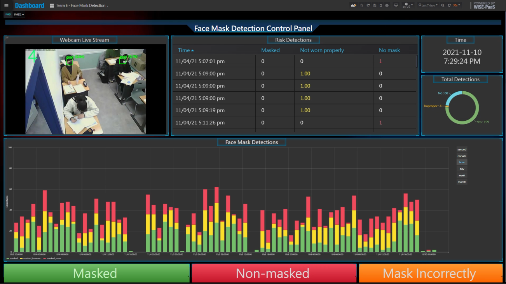

## Table of Contents

- [Face-Mask-Detection-System](#face-mask-detection-system)
  - [Table of Contents](#table-of-contents)
  - [Problem Statement](#problem-statement)
  - [Solution](#solution)
  - [Project Scope](#project-scope)
    - [Structure Chart](#structure-chart)
    - [Data Flow Diagram](#data-flow-diagram)
    - [Development Tools](#development-tools)
    - [Programming Language \& Database](#programming-language--database)
      - [Programming Language](#programming-language)
      - [Database](#database)
    - [Operating Environment](#operating-environment)
    - [System Design Diagram](#system-design-diagram)
    - [Software Architecture Design](#software-architecture-design)
    - [UI Design](#ui-design)
      - [Dashboard](#dashboard)
        - [Dashboard for monitoring](#dashboard-for-monitoring)
        - [Dashboard for management](#dashboard-for-management)
      - [Client-side interface for connection](#client-side-interface-for-connection)
    - [Database Design](#database-design)
      - [Schema](#schema)
      - [Data collected](#data-collected)
    - [Program Design](#program-design)
      - [Face Mask Detection Control Module](#face-mask-detection-control-module)
      - [Face Mask Detection Module](#face-mask-detection-module)
        - [Initialization](#initialization)
        - [Code to initialize time in a separate thread, start detection, calculate scene risk, and send to DB if high risk event is found](#code-to-initialize-time-in-a-separate-thread-start-detection-calculate-scene-risk-and-send-to-db-if-high-risk-event-is-found)
        - [Upload risk data to database](#upload-risk-data-to-database)
      - [Notifications Module](#notifications-module)
        - [Upload short video and description to Telegram](#upload-short-video-and-description-to-telegram)

## Problem Statement

On the 25th January 2020, the first case of COVID-19 was detected in Malaysia. Since then, COVID-19 has ravaged the entire nation, with over 300,000 cases as of 3 February 2021. 

As a result, one way to reduce the spread of the current pandemic, and any other future pandemics, is to introduce a face mask detection system that will analyze risk levels, and notify the authorities if the risk level is exceeded, so that more efforts will be allocated on “high-risk” areas. 

The main purpose of doing so is to reduce the chance of a localized outbreak, which is especially critical in areas with a lot of people such as schools, which will nurture our future leaders. 

## Solution

In order to solve the problem stated above, I propose a solution which will involve 4 main modules. The modules are a face mask detection module, a risk analysis module, an alert module, and finally a remote-control module.

## Project Scope

### Structure Chart

![The proposed system consists of 4 modules, which are the face mask detection module, the risk analysis, risk analysis module, alert module, and control module. The face detection module consists of two sub-modules, which are face detection and face mask detection. For risk analysis module, the system will calculate the risk on the scene, and determine if the risk threshold has been exceeded. If the risk threshold is exceeded, then the alert module is activated. The alert module then connects to a Telegram bot through the Telegram SDK, and send a notification to the telegram group the bot is connected with. Finally, for the control module, a remote-control interface is designed to allow users to remotely activate and deactivate the system. Furthermore, a remote viewing interface (i.e., a dashboard) is also designed to allow the personnel to view the status of the face mask detection.](./img/project-structure-chart.png)

### Data Flow Diagram

### Development Tools

- Python IDLE
- PyCharm
- OpenCV
- YOLOv4-Tiny
- Telegram-Bot
- MQTTBox
- Advantech WISE-PaaS/Dashboard
- Advantech SaaS Composer
- Advantech WISE-PaaS/Datahub
- Advantech WISE-PaaS/DB Services (PostgreSQL hosting platform)

### Programming Language & Database

#### Programming Language	

- Python
- JSON
- Javascript	

#### Database

- PostgreSQL

### Operating Environment

- Raspberry Pi 4
- Raspberry Pi Camera Rev 1.3

### System Design Diagram

![The design of the face mask detection with notification module for Intelligent Security System is shown below in system design diagram below. First of all, the EnSaaS web browser acts as an authentication point to allow only authorized user to access the dashboard. The dashboard is connected to the SaaS composer which allows for remote control of the face mask detection with notification module. The SaaS composer is then linked to the DataHub which acts as an intermediary connection between the Raspberry Pi devices which are executing the face mask detection with notification module, and the SaaS composer for interaction. Finally, a database is linked to the module and dashboard to provide for data storage and analysis for risk scenarios.](./img/project-system-design-diagram.png)

### Software Architecture Design

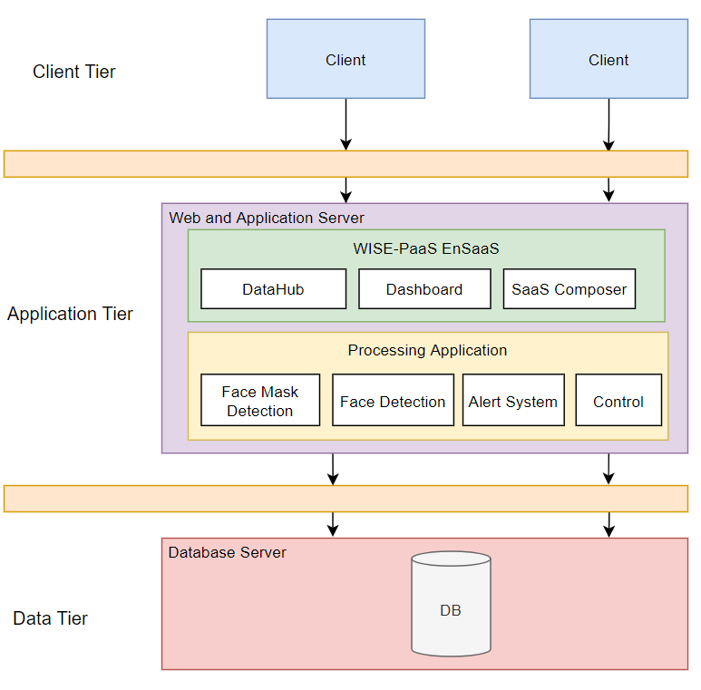

### UI Design

#### Dashboard

##### Dashboard for monitoring

##### Dashboard for management

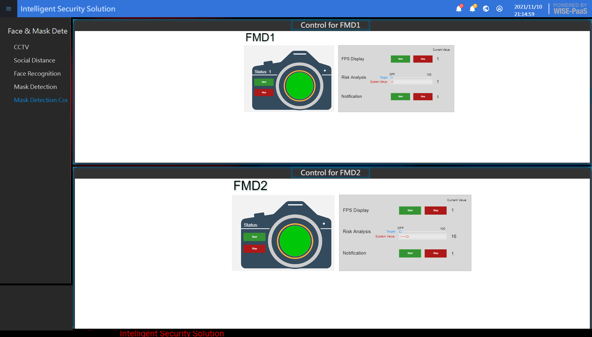

#### Client-side interface for connection

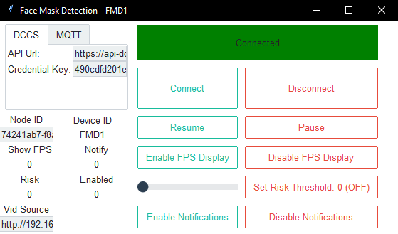

### Database Design

#### Schema

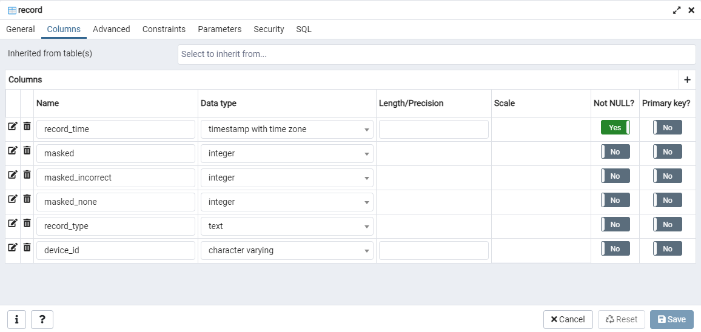

#### Data collected

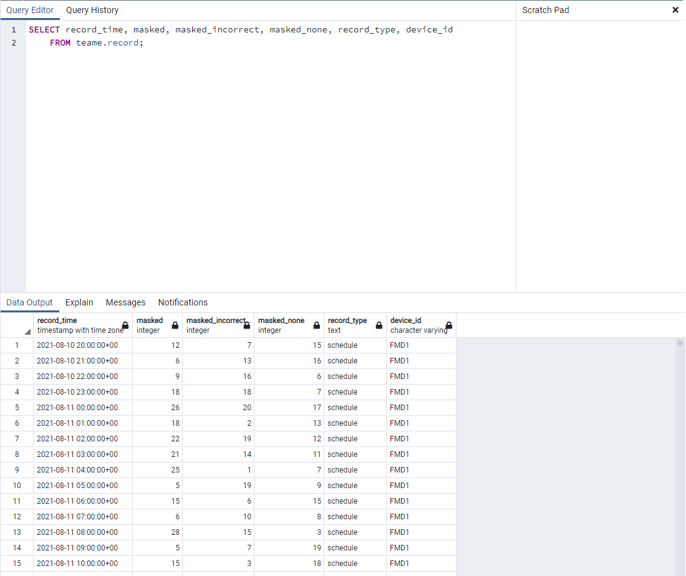

### Program Design

- The code is not available for public as there are sensitive information due to the nature of face mask detection applications. However, key features are outlined below with their respective code that do not involve sensitive information.
- The program can be split into 3 key parts, control, detection, and notifications module. Each module is contained in separate files.
- Performance considerations was made by running different logics on separate thread and gracefully handle start/stop of each thread to prevent application from 'hanging' or be stuck in a deadlock.

#### Face Mask Detection Control Module

- Code to execute main face mask detection program

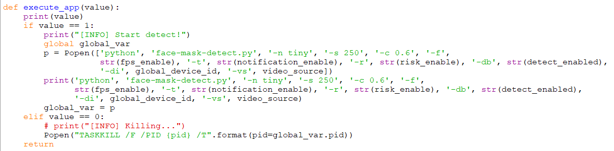

- Code to initialize GUI

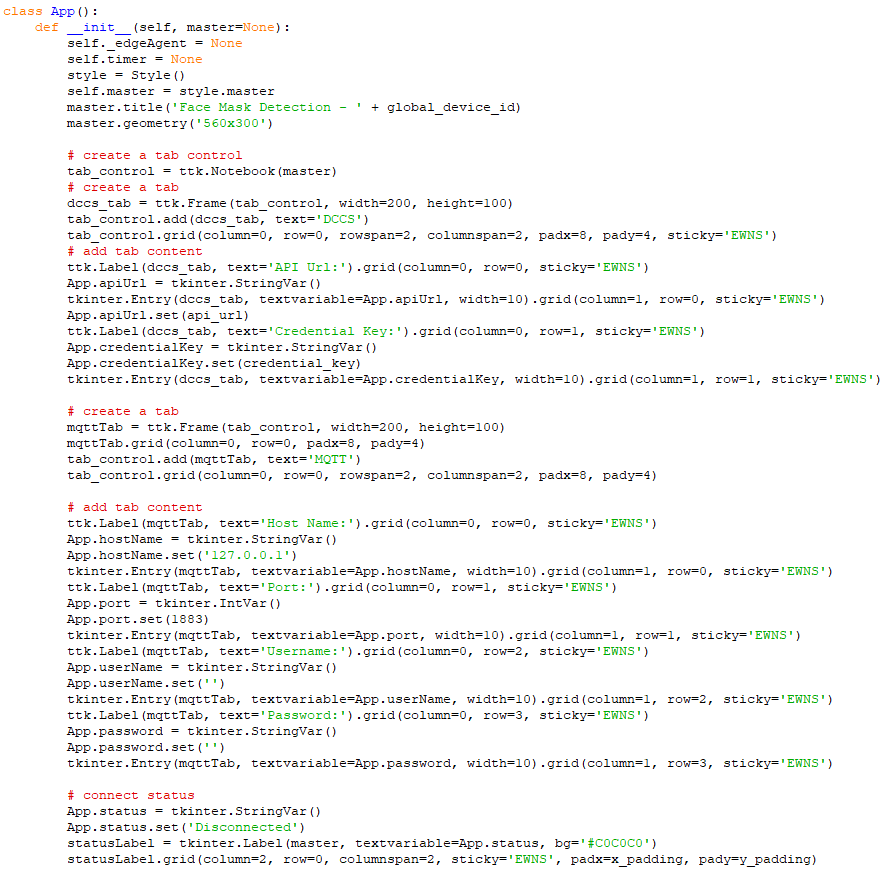

#### Face Mask Detection Module

##### Initialization

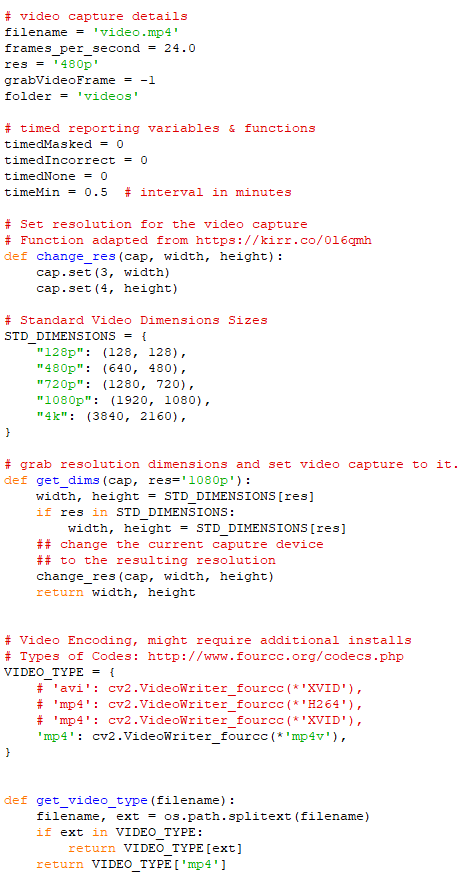

##### Code to initialize time in a separate thread, start detection, calculate scene risk, and send to DB if high risk event is found

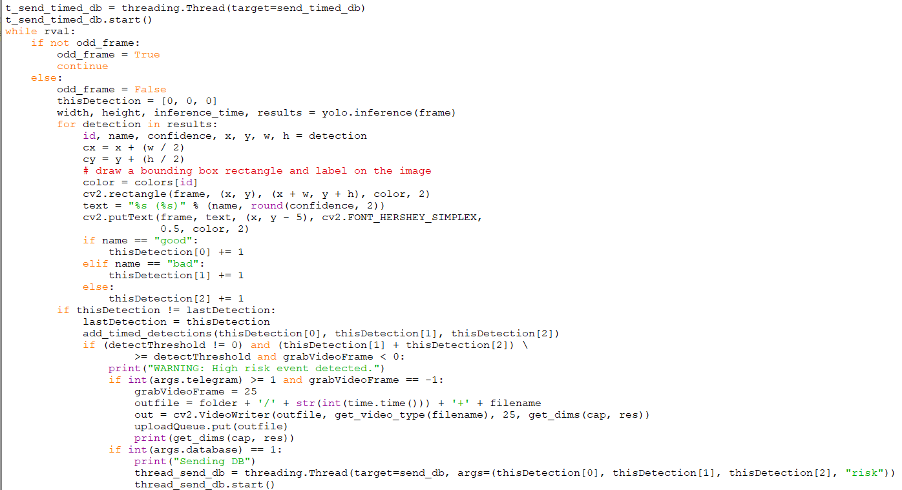

##### Upload risk data to database

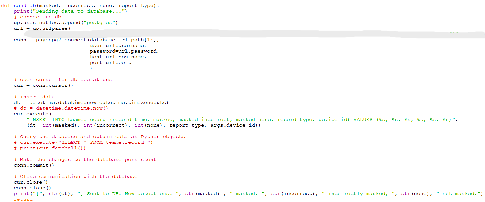

#### Notifications Module

##### Upload short video and description to Telegram

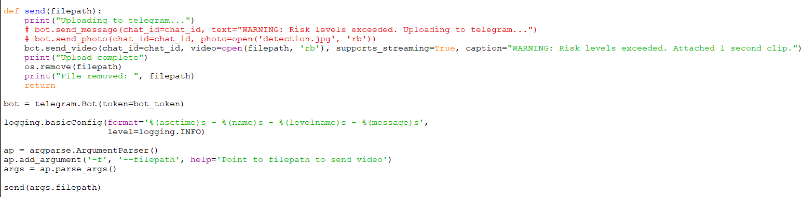